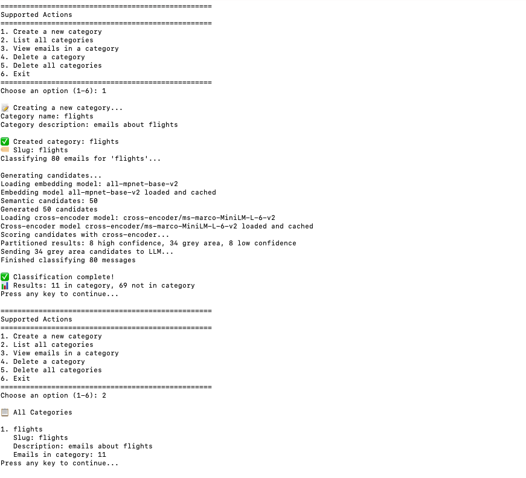
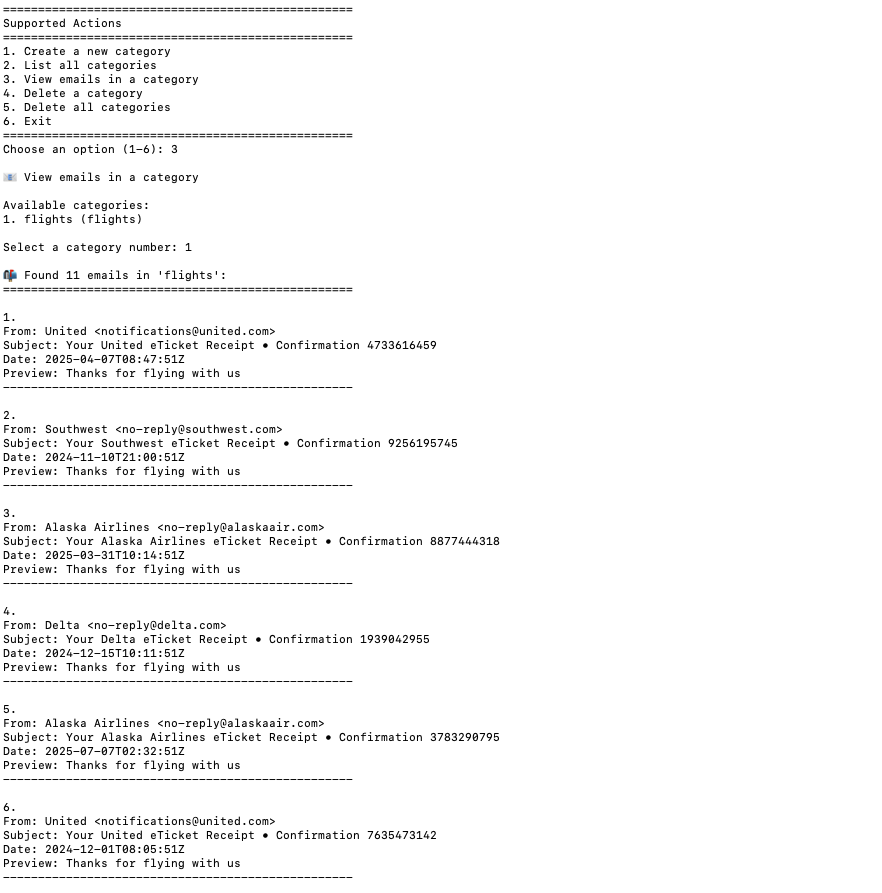

# **Goal**

Build a small service that lets a user define a **custom email category** via a natural-language description, then classifies Gmail-style messages into that category.

## **Installation**

### Option 1: Using Conda (Recommended for macOS)

```bash
# Create the environment from the environment.yml file
conda env create -f environment.yml

# Activate the environment
conda activate gmailcat

# macOS with Anaconda users may need to create this symlink
ln -sf ~/anaconda3/envs/gmailcat/lib/libmkl_intel_lp64.2.dylib ~/anaconda3/envs/gmailcat/lib/libmkl_intel_lp64.1.dylib
```

### Option 2: Using pip

```bash
# Create a virtual environment
python -m venv venv
source venv/bin/activate  # On Windows: venv\Scripts\activate

# Install dependencies
pip install -r requirements.txt
```

**Note**: On macOS with Anaconda, faiss-cpu requires MKL dependencies that are best installed via conda. If you encounter `ImportError` related to `libmkl_intel_lp64`, use the conda installation method above.

### Environment Variables

Create a `.env` file in the project root:
```
OPENAI_API_KEY=your-api-key-here
```

## **Usage**

### Ingest Messages
```bash
python -m src.email_categorizer.ingestion.ingestion sample-messages.jsonl
```

### Launch CLI
```bash
python -m src.email_categorizer.cli
```

Examples of category descriptions:

- "Work-related travel receipts from airlines"
- "Newsletters about AI research"
- "Personal emails from family members"

**Ingestion**
Ingest a JSONL file of Gmail-style messages (consider this a user's inbox). This will be done "offline" before the CLI is launched.

Example message:
```
{
    "id":"174a9",
    "subject":"Your Delta eTicket Receipt",
    "from":"Delta <no-reply@delta.com>",
    "to":["sam@example.com"],
    "snippet":"Thanks for flying with us",
    "body":"PGh0bWw+CiAgPGhlYWQ+Li4uPC9oZWFkPgogIDxib2R5Pi4uLjwvYm9keT4KPC9odG1sPg==",
    "date":"2025-08-12T14:33:22Z"
}
```

Fields:
- id (string) – unique message id
- subject (string)
- from (string, may include display name)
- to (array of strings)
- snippet (string) – short preview text
- body (string) – base64 encoded body
- date (ISO-8601 string) 

**Support user-defined categorization**
Support a simple CLI in which the user defines a natural language category. The inbox is run through the classification piepline, which returns a JSON aray for each message:
{
	"message_id": "string",
	"is_in_category": true,
	"explanation": "short, plain-English reason"
}

**Lightweight CLI interface**
Support a simple CLI in which the user can take the following actions:
1. Define a new natural language category
2. Show list of categories
3. Show emails in a particular category (will show the sender, date, subject line, and snippet)
4. Delete a category
If time allows:
5. Manually place an email in a category
6. Manually remove an email from a category


# **Classification options**
1. No LLMs
2. LLMs only
3. Filter email corpus to candidate set. Run LLM validation on all the candidates.
4. [SELECTED] Filter email corpus to 2 sets: high confidence candidates and grey area candidates. Only ask LLM to validate the grey area candidates.
    This grey area can also be **learned** / adjusted over time for each category. We want to rely on LLMs more at the beginning to make sure we are categorizing things correctly. Once we get enough data, this grey area can shrink.

    It is not in the scope of this project, but the grey area can theoretically be learned/adjusted over time for each category. We want to rely on LLMs more at the beginning to make sure we are categorizing things correctly, but the grey area can shrink once we get enough data.

LLMs can produce high-quality classifications, but they come with higher cost and latency. We select option 4 because it allows for a flexible tradeoff between scalability and quality since we can tune the score range considered the “grey area.”


# **Classification Approach**

The system uses a **multi-tier classification pipeline** that balances accuracy with cost and latency by intelligently selecting which emails require expensive LLM processing.

## **Pipeline Overview**

When a new category is created, the system classifies all emails in the inbox using a 3-phase approach:

### **Phase 1: Candidate Generation**
- **Semantic Search**: Uses FAISS vector search with sentence embeddings to find emails semantically similar to the category description
- **Candidate Limit**: Retrieves top 50 candidates by default (configurable)
- **No Keywords/TF-IDF**: Currently uses semantic search only (keyword retrieval is a future enhancement)

### **Phase 2: Cross-Encoder Scoring (Optional)**
- **Cross-Encoder Model**: Uses `cross-encoder/ms-marco-MiniLM-L-6-v2` (configurable) to score email-category relevance
- **Scoring**: Provides more precise relevance scores than semantic similarity alone
- **Configurable**: Can be disabled to use semantic scores directly

### **Phase 3: Threshold Partitioning**
- **Three Buckets**:
  - **High Confidence**: Auto-classified as TRUE (in category)
  - **Low Confidence**: Auto-classified as FALSE (not in category)  
  - **Grey Area**: Sent to LLM for final classification
- The high and low confidence thresholds are configurable

### **Phase 4: LLM Validation**
The grey area candidates are sent to the LLM for classification.


## **Configuration**
The system is configurable through `config/settings.py`:


# Screenshots
## V2



## V1


